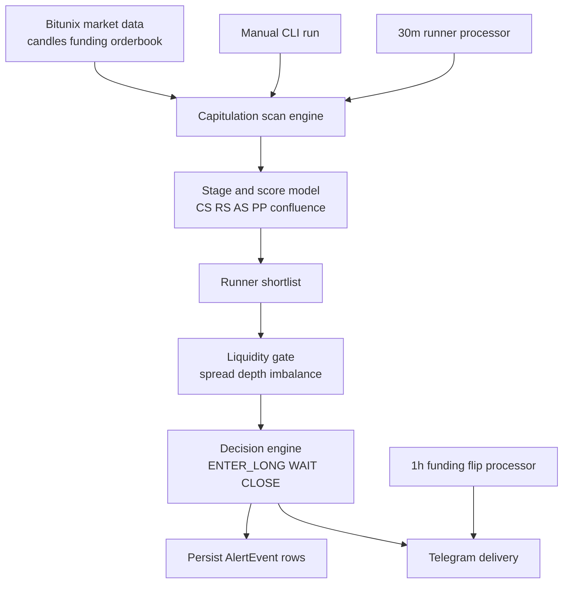

# Capitulation + Liquidity Architecture Review

## Purpose

This document describes the business logic and architecture for:

1. Capitulation transition scanning (capitulation -> recovery -> accumulation -> pre-pump)
2. Liquidity heatmap checks (spread, depth, imbalance)
3. Delivery and persistence paths (manual CLI vs automated processors)

It is written for engineer review, with explicit rationale for why each layer exists.

## Design Goals

1. Detect transitions, not just cheap tokens near ATL.
2. Prevent thin-book traps by validating order-book quality before entry decisions.
3. Separate manual exploration from automated alerting.
4. Persist state changes so decision history is queryable and auditable.
5. Keep automated loops deterministic in cadence (top-of-hour and half-hour boundaries).

## Architecture At A Glance

## Core Components

1. apps/api/src/dead-zone-engine.ts
- Computes stage and quality metrics.
- Produces stage enum and scoring fields used downstream.

2. apps/api/src/fibonacci-capitulation-scan.ts
- Builds per-symbol candidate features.
- Applies high-conviction filters and ranking logic.

3. apps/api/src/capitulation-bounce-scan.ts
- Orchestrates symbol scanning and context collection.
- Formats scan output for delivery layers.

4. apps/api/src/capitulation-scan-cli.ts
- Manual operator entrypoint.
- Runs scan and prints rankings; Telegram send is opt-in via --send-telegram.

5. apps/api/src/liquidity-check-cli.ts
- Point-in-time heatmap snapshot for selected symbols (currently BARD).

6. apps/api/src/runner-liquidity-monitor.ts
- Automated 30-minute processor.
- Runs runner shortlist, applies liquidity gate, persists state changes, sends summary.

7. apps/api/src/funding-flip-monitor.ts
- Separate hourly monitor for funding-flip/pre-flip signals and heartbeat.

8. apps/api/prisma/schema.prisma (AlertEvent model)
- Durable storage for recommendation state changes and metrics payload.

## Business Logic: Capitulation Scan

### Candidate Construction

For each active symbol:

1. Fetch daily candles.
2. Compute ATH, ATL, fibonacci distances, RSI, volatility.
3. Score transition status using dead-zone engine:
- capitulationScore (CS)
- recoveryScore (RS)
- accumulationScore (AS)
- prePumpScore (PP)
- confluenceScore
- momentumRank and riskRank
- stage label

### Stage Model

Current stage taxonomy:

1. IGNORE
2. CAPITULATION
3. RECOVERY
4. ACCUMULATION
5. PRE_PUMP
6. ACTIVE_RUN
7. OVEREXTENDED
8. DEAD_CAPITULATION

### High-Conviction Runner Filter

Runner list is intentionally strict to avoid dead-cap entries:

1. stage is not IGNORE or DEAD_CAPITULATION
2. recoveryScore > 50
3. accumulationScore > 50
4. confluenceScore >= 7

Result: candidates that are transitioning with structural confirmation, not only low price.

### Why This Is Done This Way

1. Stage separation prevents treating all depressed tokens as equivalent setups.
2. Confluence gate reduces false positives in noisy regimes.
3. Recovery + accumulation thresholds enforce evidence of demand return before "runner" labeling.
4. Delta metrics (delta score/volume/OI where available) favor improving setups, not static weakness.

## Business Logic: Liquidity Heatmap Gate

Liquidity data used:

1. spreadPct
2. bidDepthUsd
3. askDepthUsd
4. combinedDepthUsd
5. imbalance

Runner-liquidity decision logic:

1. ENTER_LONG (READY)
- Transition quality is strong (runner filter already passed)
- Liquidity confirms:
  - spread <= RUNNER_LIQUIDITY_MAX_SPREAD_PCT
  - combinedDepth >= RUNNER_LIQUIDITY_MIN_DEPTH_USD
  - imbalance >= RUNNER_LIQUIDITY_MIN_BUY_IMBALANCE

2. CLOSE (CAUTION)
- Liquidity deterioration detected:
  - spread >= RUNNER_LIQUIDITY_WIDE_SPREAD_EXIT_PCT
  - or depth collapses below guardrail fraction
  - or imbalance <= RUNNER_LIQUIDITY_EXIT_IMBALANCE

3. WAIT (CAUTION or UNRESOLVED)
- Transition or liquidity not yet sufficient, or order book unavailable.

### Why This Is Done This Way

1. Spread limits execution friction and slippage risk.
2. Depth guard avoids entries where small orders move price materially.
3. Imbalance check adds directional microstructure confirmation.
4. Exit-on-deterioration acts as a live risk-off layer after initial signal qualification.

## Delivery Paths

## Path A: Manual Operator Scan

Command example:

npm run scan:capitulation -- --fast-pump

Behavior:

1. Runs one snapshot scan.
2. Prints ranked outputs to terminal.
3. Does not send Telegram by default.
4. Optional send only with --send-telegram.

Rationale:

1. Manual investigations should not generate automatic channel noise.
2. Operator can inspect output before deciding escalation.

## Path B: Automated Processor (30m)

Entrypoint:

npm --workspace @strata/api run monitor:runner-liquidity

Behavior per cycle:

1. Run capitulation transition scan.
2. Select top runners.
3. Run liquidity checks per runner.
4. Compute ENTER_LONG/WAIT/CLOSE.
5. Persist only changed states to AlertEvent.
6. Send Telegram summary.
7. Sleep until next half-hour boundary.

Rationale:

1. State-change persistence avoids duplicate spam and keeps event history meaningful.
2. Boundary alignment gives predictable cadence and simpler incident correlation.

## Path C: Automated Funding Monitor (1h)

Entrypoint:

npm --workspace @strata/api run monitor:funding-flips

Behavior:

1. Detects funding flips and pre-flip setups.
2. Sends signal alerts plus heartbeat.
3. Aligns runs to top-of-hour.

Rationale:

1. Funding regime changes are orthogonal to capitulation transitions and deserve separate monitoring.
2. Heartbeat provides operational proof of life.

## Persistence Model

AlertEvent rows store:

1. symbol, signalState, signalType, recommendation
2. metrics JSON payload (scores and liquidity telemetry)
3. createdAt timestamps for timeline reconstruction

Current runner signalType values:

1. RUNNER_LIQUIDITY_BUY
2. RUNNER_LIQUIDITY_WAIT
3. RUNNER_LIQUIDITY_EXIT

Why AlertEvent is used:

1. Existing domain model for signal history.
2. Queryable in APIs/dashboard tooling.
3. Supports audit and post-mortem analysis without introducing a new table yet.

## Fly Deployment Topology

Configured process groups:

1. app
2. monitor (funding)
3. runner_liquidity

Relevant environment controls:

1. FUNDING_FLIP_POLL_INTERVAL_MS (default 3600000)
2. RUNNER_LIQUIDITY_POLL_INTERVAL_MS (default 1800000)
3. RUNNER_LIQUIDITY_MAX_RUNNERS
4. RUNNER_LIQUIDITY_MIN_DEPTH_USD
5. RUNNER_LIQUIDITY_MAX_SPREAD_PCT
6. RUNNER_LIQUIDITY_MIN_BUY_IMBALANCE
7. RUNNER_LIQUIDITY_EXIT_IMBALANCE
8. RUNNER_LIQUIDITY_WIDE_SPREAD_EXIT_PCT

## Failure Modes And Handling

1. Missing orderbook for a runner
- Decision becomes WAIT with UNRESOLVED state.

2. External API noise/rate limits
- Scan pipeline continues with skip handling where possible.

3. Telegram delivery issues
- Monitor still persists decision changes before send failures surface.

4. No high-conviction runners in cycle
- Monitor completes without forced entries.

## Review Checklist For Engineers

1. Validate threshold defaults against current market microstructure.
2. Confirm runner filter strictness aligns with expected candidate count.
3. Verify AlertEvent growth and retention strategy.
4. Verify no accidental Telegram send in manual workflows.
5. Confirm process health and cadence using Fly status and logs.
6. Validate if openInterest delta source should be upgraded for stronger OI-driven rules.

## Suggested Near-Term Improvements

1. Add dedicated persistence model if decision analytics outgrow AlertEvent.
2. Add symbol alias normalization for cross-venue naming drift.
3. Add monitor-level metrics endpoint (decision counts, lag, last success).
4. Add replay harness for threshold backtesting on historical order-book snapshots.
